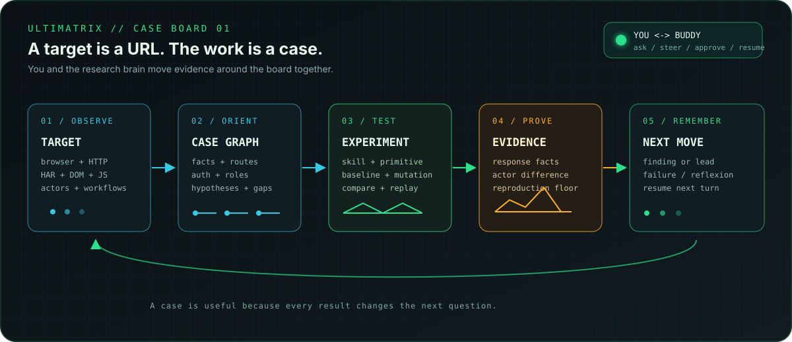
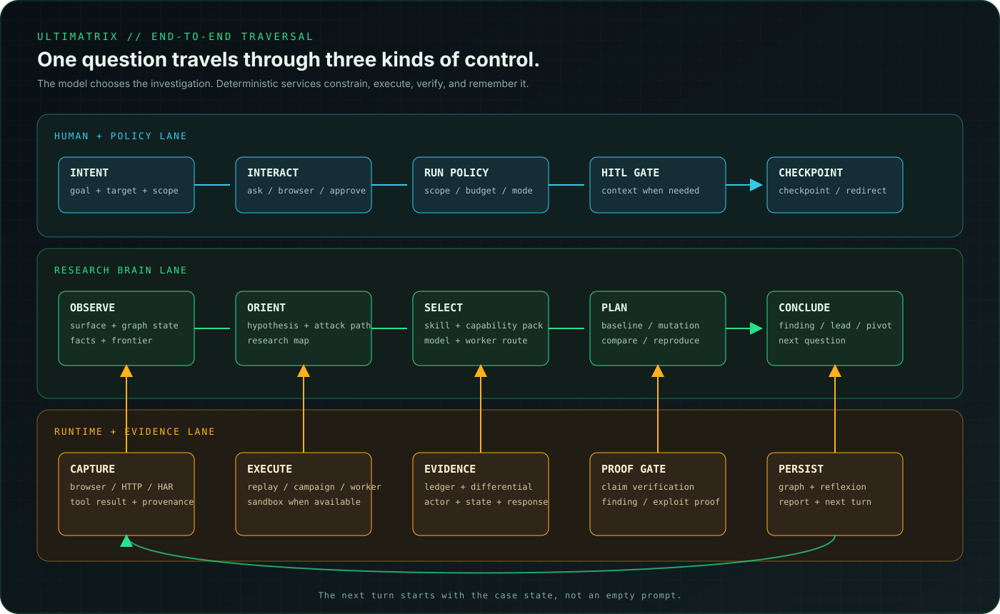

<p align="center">
  
</p>

<h1 align="center">Ultimatrix</h1>

<p align="center">
  <strong>The target is a URL. The work is a case.</strong><br>
  An intelligence-augmented security researcher for people who want to understand a system before testing it.
</p>

<p align="center">
  <a href="https://www.npmjs.com/package/ultimatrix"></a>
  
  
  
  
  
</p>

<p align="center">
  <a href="#start-here"><strong>Start</strong></a> ·
  <a href="#the-story"><strong>The story</strong></a> ·
  <a href="#what-it-solves"><strong>Why it exists</strong></a> ·
  <a href="#how-it-works"><strong>How it works</strong></a> ·
  <a href="docs/USER-GUIDE.md"><strong>Docs</strong></a>
</p>

---

## First, the difference

| A conventional scanner | Ultimatrix |
|---|---|
| Starts with a URL and a bag of payloads | Starts with a target, scope, credentials, and a question |
| Fires requests, then sorts responses | Observes the application and builds a case graph first |
| Repeats the same crawl after every restart | Resumes endpoints, actors, workflows, hypotheses, and failures |
| Treats a model as a request generator | Gives the model structured state, skills, tools, and proof rules |
| Calls an interesting string a finding | Keeps leads separate from evidence-backed claims |
| Makes the human drive every next step | Lets you collaborate, supervise, or let the loop continue autonomously |

The product is solving a coordination problem: **security testing is not one action. It is a sequence of observations, decisions, experiments, failed paths, and proofs that must stay connected.**

<p align="center">
  
</p>

<p align="center"><sub>The board is the product: every observation becomes context, every test changes the next question, and every claim has a path back to evidence.</sub></p>

## The story

Imagine you hand Ultimatrix an authorized web application and say:

> “Understand the checkout flow. Look for authorization mistakes. Do not mutate customer data.”

This is what should happen.

### 1. The URL becomes a surface

The first job is not to guess a payload. The runtime opens the browser and watches what the application actually does: routes, rendered controls, forms, Fetch/XHR calls, cookies, headers, JavaScript assets, redirects, and state changes. Direct HTTP and HAR/CDP capture add what the browser does not make obvious.

```text
target URL
   |
   +--> pages, routes, forms, inputs
   +--> requests, responses, headers, cookies
   +--> workflows, actors, auth transitions
   +--> scripts, API hints, shadow endpoints
```

If the browser cannot start, a provider is unavailable, or Docker cannot be reached, that becomes an explicit state. The system does not convert an infrastructure failure into a fake observation.

### 2. The surface becomes a case

Observations are projected into a graph instead of being left as a scrolling log. An endpoint can be connected to the page that revealed it, the actor that reached it, the input that influenced it, the hypothesis that targets it, and the experiment that tested it.

```text
Page -> Action -> Input -> Endpoint -> Hypothesis -> Experiment
  \                                      |              |
   -> AuthFlow / RBACRole ---------------+              v
                                      Evidence -> Proof -> Finding
```

This is why a later turn can ask “what remains untested?” instead of starting the crawl from zero.

### 3. The case becomes a question

The research brain does not need a target-specific script. The live skill registry selects methodology from the observed state: authorization, API behavior, business logic, injection, GraphQL, race conditions, and so on. A skill can contribute:

- the relevant tools and primitives;
- an ordered procedure;
- baseline, mutation, comparison, and reproduction stages;
- a coverage contract describing what “done” means;
- composition and conflict rules for adjacent techniques.

The model still chooses the next move. The runtime decides which capabilities are available, which URLs are in scope, what needs approval, and what evidence is sufficient.

### 4. The question becomes an experiment

For example, after observing an order endpoint, the buddy may propose:

```text
Hypothesis: the object owner is checked in the API, not only in the UI.

Baseline:  GET /api/orders/42 as the owner actor
Mutation:  replay the captured request as the analyst actor
Compare:   status, body shape, ownership fields, side effects
Reproduce: repeat the difference with a fresh capture
```

The request is not valuable because it was sent. It is valuable because it answers a falsifiable question.

### 5. The experiment becomes evidence

Every claim is checked against typed evidence: method, URL, actor, status, response facts, provenance, and reproduction references. The EvidenceGate and proof rules decide whether a claim can be promoted.

An exposed token-shaped string can remain an informational lead. A failed request can remain a failure. A confirmed authorization flaw gets a finding, severity, lifecycle state, and—when the proof floor is met—an exploit-proof record.

### 6. The evidence becomes the next move

Success changes technique weights. Failure becomes reflexion: what was blocked, what was stale, which assumption was wrong, and what should be tried next. Captured flows, graph facts, and policy-approved outcomes remain available to the next turn and the next session.

That is the loop:

```text
 observe -> orient -> test -> prove -> learn
     ^                                  |
     +---------- next best question ----+
```

### The full traversal

The important detail is that the model does not own the whole system. It proposes research moves; session services, capability policy, scope, resource claims, evidence rules, and persistence carry those moves through the product.

<p align="center">
  
</p>

<p align="center"><sub>Human and policy shape the boundary. The research brain chooses the question. Deterministic runtime services execute, verify, and preserve the result.</sub></p>

### What actually travels through the system

The hand-offs are typed and inspectable. A request does not jump directly from prompt to payload:

| Step | Artifact that moves forward | Who owns the decision | What can stop or redirect it |
|---|---|---|---|
| 1 | Goal, target, scope, interaction mode | Session runner + human | Missing target, invalid scope, unsupported mode |
| 2 | Pages, requests, responses, DOM reactions, auth transitions | Browser/HTTP/HAR observers | Browser/provider failure, out-of-scope URL, rate limit |
| 3 | Graph facts, endpoint state, actors, workflows, frontier | Engagement graph + blackboard | Duplicate observation, stale state, missing authorization |
| 4 | Skill metadata and selected methodology body | Live skill registry | Unknown skill, invalid import, missing tool/primitive |
| 5 | Capability pack, plan, hypothesis, experiment contract | Research brain + capability compiler | Policy, budget, risk, resource claim, dependency |
| 6 | Typed tool call and typed tool result | Tool registry / worker / campaign | Tool unavailable, timeout, sandbox boundary, model/provider error |
| 7 | Evidence item, provenance, comparison, reproduction | Evidence ledger + EvidenceGate | Insufficient proof, conflicting status, missing actor/state |
| 8 | Candidate, verified finding, exploit proof, or reflexion | Finding/proof rules | Rejected claim, failed proof floor, needs human review |
| 9 | Graph persistence, forensic log, next question, report | Engagement services | Checkpoint failure is surfaced; it is not silently discarded |

The same traversal feeds the user-facing stream as typed messages: `phase`, `event`, `reasoning`, `tool`, `tool-result`, `answer`, and `done`. That is what lets the CLI and web workspace show progress without pretending every line is model reasoning.

## What it solves

### Context loss

**Problem:** a restarted agent forgets routes, actors, failed attempts, and why a request mattered.

**Response:** a per-engagement graph, workflow checkpoint, captured-request store, forensic log, and policy-gated memory preserve the case. Global memory is not a dumping ground for target secrets.

### Blind tool use

**Problem:** a model sees thirty tools and picks an HTTP request because it is the easiest button to press.

**Response:** skill metadata, capability compilation, tool filtering, research hypotheses, budgets, and typed tool results narrow the decision surface. Browser, replay, campaign, sandbox, and specialist-worker tools are available when the observed problem justifies them.

### “The model said it is vulnerable” findings

**Problem:** a plausible explanation gets reported without a response difference or reproduction.

**Response:** the evidence ledger, EvidenceGate, proof rules, finding lifecycle, and exploit-proof nodes separate hypotheses, candidates, verified findings, and rejected claims.

### Human intervention becoming a dead end

**Problem:** login, MFA, CAPTCHA, business context, or a risky action blocks the agent—or the user has to dictate every next request. And a correction given in passing evaporates, so the same false positive is re-derived next session.

**Response:** `interact` is a mutual research loop. The buddy can ask a focused question, wait for a browser action, observe what the human did, accept a correction, and continue from the same state. `solve` can run within a configured autonomous policy.

What you tell it about the application becomes **structure, not scrollback**. A *disposition* is an append-only ruling on a claim — written in the same shape whether it came from you or from the agent, so neither side gets a private bookkeeping path. Say "that's normal, it's a demo range" and it stops re-raising it; the reason you gave travels with the ruling, survives a restart, and is shown back to the agent so it does not rediscover what you already settled. `/rulings` shows the history; `/brief` shows what is still unruled.

The same log carries disagreement in both directions. If you overrule it, your reason is on record. If it disagrees with you, it can record its own verdict, the claim is marked **contested**, and neither side quietly wins.

### An assistant that agrees with you

**Problem:** an assistant under instruction to be agreeable will invent a ruling you never made, or quietly drop a verdict you never asked it to keep. Both hide the disagreement, and both look like a working system.

**Response:** ruling coverage is stated explicitly rather than inferred. Every turn's runtime index lists what has **not** been ruled on, so the model cannot assume a general ruling exists to cover the gaps. Agreeing in words records nothing, and a turn that ends with nothing delivered says *what broke and what to do about it* instead of going quiet.

### A mandate you cannot act on

**Problem:** the agent is told to use a capability it was never given, and told separately never to call a tool it cannot see. It then obeys both and does nothing, while every structural check passes.

**Response:** the brain's turn-one tool set is asserted in tests against the capabilities the prompt depends on. A tool the instructions name but the agent does not carry is a test failure, not a silent no-op.

### Tools that fail mysteriously

**Problem:** a missing binary, provider outage, Docker permission, or unavailable browser looks like “the target is secure.” A provider that 503s mid-turn looks like the tool is thinking.

**Response:** capability checks, model routing/fallback, browser-provider lifecycle, sandbox diagnostics, rate limits, timeouts, and explicit skip/error events keep environmental gaps separate from security conclusions. A failed turn states what broke, whether anything was changed, and what to change — a rejected credential, a provider outage, and a transport death each get their own answer. There is no input for which a failure produces an empty message.

## How it works

```text
YOU / WEB UI / CLI
        |
        v
SESSION RUNNER  ---- owns one engagement and its lifecycle
        |
        +--> SOLVER (OODA) ------- reason, explore, conclude
        +--> COUNCIL -------------- debate typed proposals
        +--> LEGACY ---------------- compatibility workflow
        |
        v
CASE SERVICES
  graph | capture | memory | blackboard | evidence | model selector
        |
        +--> skills + capability compiler
        +--> browser + HTTP + replay + workers
        +--> campaigns + task graphs + sandbox adapters
        |
        v
DELIVERABLES
  findings | exploit proofs | reports | replayable evidence | next question
```

### The main building blocks

| Building block | Responsibility |
|---|---|
| [Observation](src/capture/) | Stagehand/Playwright browser control, optional Camoufox, HTTP, HAR/CDP capture, passive DOM/network observation, spidering, JavaScript/shadow discovery |
| [Case graph](src/graph/) | Pages, rendered elements, endpoints, actors, auth flows, roles, workflows, hypotheses, experiments, findings, reachability, and proof relationships |
| [Skill registry](src/solver/skills/) | 88 indexed skills across 19 domains; lazy bodies, tool references, primitives, contracts, composition/conflict rules, and import validation |
| [Research brain](src/solver/) | OODA loop, hypothesis generation, experiment planning, reflexion, attack paths, model selection, recovery, and fallback routing |
| [Execution](src/tools/) | Browser and HTTP tools, captured-request replay, campaigns, task graphs, specialist workers, council delegation, OAST, and Linux/Docker adapters |
| [Evidence](src/intelligence/) | Typed observations, provenance, differential checks, proof floors, finding lifecycle, exploit proofs, and chain verification |
| [Output](src/output/) + [web](src/app/api/) | Append-only terminal stream, web SSE stream, graph views, finding cards, reports, forensic NDJSON, and resumable sessions |

<details>
<summary><strong>The complete skill map</strong> - what the registry can load today</summary>

The registry currently indexes these 88 skills. They are discoverable metadata first and loaded as methodology only when the case needs them; this list is not a promise that every target exercises every skill.

| Domain | Indexed skills |
|---|---|
| API security | `ai-mcp-security`, `api-fuzzing`, `api-security`, `graphql-attacks`, `graphql-depth-introspection`, `websocket-attacks` |
| Authentication | `authorization`, `jwt-advanced`, `jwt-algorithm-confusion` |
| Bug bounty | `account-takeover-chains`, `api-authorization-matrix`, `bug-bounty-research`, `bug-bounty-scenarios`, `cache-boundary-testing`, `graphql-authorization`, `http-desync`, `web-message-boundaries`, `webhook-ssrf` |
| Cloud | `aws-iam-exploitation`, `azure-exploitation`, `docker-escape`, `gcp-exploitation`, `kubernetes-security`, `serverless-attacks` |
| Crypto | `crypto-toolkit`, `ctf-crypto`, `tls-attacks` |
| Injection | `command-injection-advanced`, `email-injection`, `exploitation`, `nosql-injection`, `second-order-sqli`, `ssti`, `vuln-discovery`, `xxe` |
| IoT / LLM / mobile | `iot-security`, `llm-agentic-security`, `mobile-security` |
| Methodology | `api-methodology`, `cloud-methodology`, `web-methodology` |
| Network / recon | `network-attacks`, `ctf-misc`, `hsts-bypass`, `information-disclosure`, `intranet-pentest`, `osint-recon`, `post-exploitation`, `recon`, `ssl-stripping`, `subdomain-takeover` |
| Offensive | `edr-evasion`, `shellcode-exploit-dev` |
| Post-exploitation | `anti-forensics`, `c2-frameworks`, `data-exfiltration`, `lateral-movement`, `persistence` |
| Privilege escalation | `linux-privesc`, `windows-privesc` |
| Reporting | `reporting` |
| Social / supply chain | `phishing`, `social-engineering`, `supply-chain` |
| Web attacks | `blind-ssrf`, `business-logic`, `cache-poisoning`, `clickjacking`, `cors-misconfig`, `css-injection`, `deserialization`, `host-header-injection`, `http-smuggling`, `modern-xss`, `open-redirect`, `prototype-pollution`, `race-conditions-advanced`, `security-headers-audit`, `type-juggling`, `waf-bypass`, `web-pentest`, `web-security-advanced` |
</details>

<details>
<summary><strong>The toolbox</strong> - what a selected skill can reach</summary>

| Tool family | Examples |
|---|---|
| Observe and orient | `getTargetSummary`, `getCaptureOverview`, `getGraphSchema`, `queryGraph`, `queryRelations`, `getWorkflowAround`, `traceValue`, `explainReachability` |
| Discover methodology | `listSkills`, `searchSkills`, `discoverSkillsForTarget`, `loadSkillBody`, `loadSkillReference`, `manageSkills` |
| Browser and human | Stagehand/Camoufox navigation, observation, actions, extraction, `askUser`, `observeHumanActions`, `reproduceFlow` |
| HTTP and replay | `httpRequest`, `listCapturedRequests`, `replayCapturedRequest`, `getCapturedHeaders`, `encodeDecode` |
| Research execution | `runRecon`, `runPrimitive`, `runCampaign`, worker routing, task graphs, council execution |
| Evidence and findings | `recordEvidence`, `linkEvidenceToClaim`, `recordOutcome`, `recordFindingCandidate`, `writeFinding`, `verifyChains` |
| Two-sided rulings | `recordDisposition`, `getDispositions` — the operator and the agent rule on the same claims, with reasons |
| External execution | Nuclei, SQLMap, FFUF, Nmap, Gobuster, Nikto, Masscan, Subfinder, HTTPX, Arjun, Corsy, JWT tooling, Hydra, John, and Gitleaks through capability-gated adapters |
</details>

<details>
<summary><strong>Graph depth</strong> - what is persisted</summary>

The graph currently defines 25 node types and 21 edge types. It is the case memory, not a transcript archive. Captured requests can be replayed with structural mutations, and failed approaches can become reflexion rather than disappearing after a timeout.
</details>

<details>
<summary><strong>Parallelism</strong> - when it is actually used</summary>

Normal solver turns are not silently duplicated. Campaigns, task graphs, and council cycles may request bounded parallel slices. Dependencies, resource claims, budgets, and rate limits constrain that work. The configured default is conservative (`maxParallel: 1`).
</details>

<details>
<summary><strong>Memory</strong> - what “learns” means</summary>

Engagement memory contains target-sensitive state. Reflexion and technique-outcome stores learn from failed and confirmed experiments. Cross-engagement/global writes pass through a sensitivity policy; secrets, target URLs, auth state, storage, and request payloads are not promoted automatically.
</details>

## Two ways to work with it

| Surface | What it feels like | Runtime behavior |
|---|---|---|
| `ultimatrix interact -t <url>` | A research partner at the keyboard | Ask mode; you can redirect, provide credentials, act in the browser, or approve a meaningful step |
| `ultimatrix solve -t <url>` | A bounded autonomous assessment | Run mode; the loop continues without waiting for HITL prompts, but scope, budgets, capability checks, and evidence gates remain active |
| `ultimatrix web` | The case wall | Chat, graph, findings, approvals, and live progress in one workspace |

The stream has typed channels rather than one ambiguous text blob:

```text
runtime  observing target surface
skill    authorization loaded
tool     replayCapturedRequest  GET /api/orders/42
tool     result                  200 application/json
brain    compare this response under the analyst actor
finding  HIGH  cross-tenant object access  @ /api/orders/42
```

Reasoning is shown only when the provider emits a reasoning channel. Runtime labels are never presented as the model’s private thought.

## Coverage, honestly stated

| Surface | Boundary |
|---|---|
| SPAs, routed applications, Fetch/XHR, and APIs | Browser routes, rendered elements, requests, responses, headers, parameters, timing, and replay |
| Authenticated workflows | Requires credentials or an observed browser flow |
| Authorization and business logic | Depends on observed actors, states, invariants, and workflows |
| GraphQL, injection, and modern web attacks | Skill-driven and target-dependent |
| Race testing | Bounded primitive against an authorized state-changing endpoint |
| CAPTCHA and anti-bot | Human-assisted pause/resume |
| WebSockets | Methodology exists; dedicated frame capture remains partial |
| Linux tools | Local-first, Docker fallback, capability-gated |

Camoufox requires a provisioned executable. Docker tools require an accessible daemon and image. A provider outage can stop model-driven exploration. Those are visible boundaries, not claims about the target.

## Start here

```bash
git clone https://github.com/Msalways/Ultimatrix.git
cd Ultimatrix
npm install
npx playwright install chromium
npx ultimatrix init
```

```bash
# Mutual research loop
npx ultimatrix interact -t https://app.example.com

# Bounded autonomous OODA assessment
npx ultimatrix solve -t https://app.example.com

# Web workspace
npx ultimatrix web
```

Keep credentials outside source control. Use `providers.yaml` or the setup wizard; do not pass API keys on the command line.

## SDK

```ts
import { Ultimatrix } from 'ultimatrix'

const researcher = new Ultimatrix({
  target: 'https://app.example.com',
  outputDir: './output',
})

try {
  const result = await researcher.scan()
  console.log(result.findings)
} finally {
  await researcher.close()
}
```

## Builder's shelf

| Read this | When you need it |
|---|---|
| [User Guide](docs/USER-GUIDE.md) | Install, providers, workflows, persistence, and reports |
| [Architecture](docs/ARCHITECTURE.md) | Engine boundaries, graph, skills, tools, memory, and web routes |
| [Skill Packs](docs/SKILL-PACKS.md) | Author or import validated methodology |
| `npx ultimatrix --help` | Current CLI surface |

### Workflow attack planning

The research map now imports operator-demonstrated workflows with their captured request IDs and original order. Those observed traces can produce replay/step-skip hypotheses; endpoint-grouped workflow context is labeled inferred and cannot claim to be an observed sequence. It also surfaces action-limit hypotheses only when an explicit limit appears in a successful captured response and a successful state-changing request is captured on that route or in the same observed workflow. The experiment plan keeps these as candidates and asks for a same-actor state baseline; solver bootstrap surfaces the source and canonical request IDs to the brain. The campaign planner ties a captured multi-step workflow to its terminal state-changing endpoint and passes the ordered observed steps to the probe. The probe reuses the captured terminal request; an accepted replay is recorded as a candidate because the captured actor may still hold state from earlier steps. Confirmation requires a fresh actor/session check of the resulting business state. Action-limit and quota checks resolve the request by captured request ID, replay it at most ten times, and require a target-stated limit, captured baseline, and observed state change before confirmation; HTTP success alone stays a candidate. CLI and web assessment summaries show analyzer-derived business-logic fact counts and separate tested, candidate, and blocked workflow/business-logic units.

### Internal live discovery benchmark

With an NVIDIA API credential available from the environment or provider configuration, run:

```bash
npm run benchmark:discovery -- --runs 3 --out evals/live-discovery.json
```

It runs `interact -t` against randomized, disposable loopback apps with matched vulnerable and patched workflows. The solver maps workflows and hypotheses before deterministic coverage; matching research hypotheses raise the priority of their observed endpoints. CLI and web run summaries show the learned workflow and hypothesis counts, experiment statuses, tested endpoint/actor/state coverage, and explicit unknowns.

The report separates target learning from confirmed findings: expected endpoint/method recall, ordered observed workflow sequence recall for the two stateful cases, fixture-appropriate hypothesis recall, workflow mapping, and experiments that are planned, attempted, completed, or blocked. Case 1 requires both a learned state-transition bypass and the explicit one-use action limit; other cases require their relevant workflow or authorization hypothesis. A benchmark pass requires at least 7 of 9 vulnerable runs and 7 of 9 patched controls to map a workflow, identify every expected hypothesis class, attempt a research experiment, and map the expected ordered stateful workflow when one is scored; the existing proof threshold still requires at least 7 independently retested vulnerable findings and zero confirmed control findings. For one-time workflow checks, duplicate acceptance is only a candidate until the resulting state is checked with fresh evidence; duplicate rejection is expected secure behavior. Without an NVIDIA credential, the benchmark records `untested` and makes no model calls, so live discovery effectiveness remains unmeasured. Each target run is limited to 100 HTTP requests and five minutes. Reports under `evals/` are local benchmark artifacts.

```bash
npm test                 # full Vitest suite
npm run test:evals       # architecture boundary evaluations
npm run typecheck        # strict TypeScript checks
npm run build:cli        # CLI bundle
npm run build:web        # Next.js workspace
```

<p align="center"><sub>Built for researchers who want their tools to remember, show their work, and earn confidence.</sub></p>
<p align="center"><strong>Authorized testing only.</strong></p>


