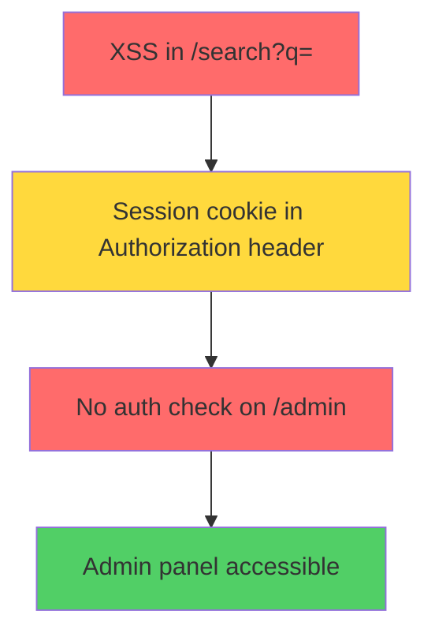

# Ultimatrix v1.0 — Chain-Focused Autonomous Security Scanner

> **Status**: Minimal viable product that competes with Burp Suite.

---

## Overview

Ultimatrix v1.0 is the **first autonomous security scanner that detects attack chains, visualizes them with Mermaid diagrams, and explains why each attack works using LLM-driven reasoning.**

---

## Competitive Advantage

| Feature | Ultimatrix v1.0 | Burp Suite | OWASP ZAP |
|---|---|---|---|
| **Chain Detection** | ✅ LLM-driven chain reasoning | ❌ Passive scanning only | ❌ No chain detection |
| **Chain Visualization** | ✅ Mermaid diagram | ❌ Raw HTTP log | ❌ No chain visualization |
| **Chain-First Report** | ✅ Chains shown before findings | ❌ Findings shown first | ❌ No chain-first report |
| **Confidence Scoring** | ✅ Filter false positives | ❌ No filtering | ❌ No confidence |
| **Narrative Logging** | ✅ Human-readable progress | ❌ Raw HTTP requests | ❌ No narrative |
| **LLM-Driven Reasoning** | ✅ Explains why attacks are made | ❌ Rule-based heuristics | ❌ No LLM reasoning |
| **Price** | FREE (open source) | $400+/year | FREE |

---

## What Ultimatrix v1.0 Does

### **1. Autonomous Scanning**

Ultimatrix runs a loop:
- **Observe**: Spider crawls web app, captures HAR, builds graph
- **Learn**: Analyzes patterns, generates hypotheses
- **Attack**: Spawns workers, attacks hypotheses in parallel
- **Chain Detection**: Detects cross-technique chains
- **Checkpoint**: Asks user for intervention if needed
- **Repeat**: Continues until exit criteria are met

### **2. Chain Detection**

Ultimatrix detects attack chains like:
- XSS → Session Hijack → Admin Access
- SQL Injection → Database Escalation → Remote Code Execution
- JWT Kid Injection → Privilege Escalation → Admin Access
- OAuth Redirect URI Bypass → Application Takeover

**How it works:**
```typescript
// LLM analyzes findings
const chains = await chainDetector.detectChains({
  findings: currentFindings,
  appModel: currentAppModel,
  traces: recentTraces
})

// Returns:
[
  {
    id: 'chain_001',
    techniques: ['xss', 'session-fixation', 'admin-access'],
    description: 'XSS in /search param can steal session cookies. Session fix on /login uses same cookie. Admin panel /admin has no auth.',
    impact: 'Attacker can: inject XSS → victim visits page → session stolen → access /admin as victim',
    severity: 'CRITICAL',
    confidence: 0.92,
    evidence: [...]
  }
]
```

### **3. Chain Visualization**

Ultimatrix visualizes chains with Mermaid diagrams:


### **4. Chain-First Report**

Ultimatrix shows chains **before** individual findings:
```
# Ultimatrix Report — https://target.com

## 🔗 Chains Detected (2)

### 🔴 CRITICAL: XSS → Session Hijack → Admin Access
- Techniques: XSS, Session Fixation, Admin Access
- Impact: Attacker can: inject XSS → victim visits page → session stolen → access /admin as victim
- Confidence: 92%
- Evidence:
  1. XSS at /search?q=<script>alert(1)</script> (severity: CRITICAL)
  2. Session fixation at /login with same cookie (severity: HIGH)
  3. No auth on /admin (severity: CRITICAL)
- Next Steps:
  1. Inject XSS payload to steal session cookie
  2. Login to /admin using stolen cookie
  3. Confirm admin access

---

### 🟡 HIGH: SQL Injection → Database Escalation → Remote Code Execution
- Techniques: SQL Injection, Database Escalation, Remote Code Execution
- Impact: Attacker can: inject SQLi → read database → escalate privileges → execute remote commands
- Confidence: 85%
- Evidence:
  1. SQLi at /api/users?id=1' (severity: CRITICAL)
  2. Database error message leaked (severity: HIGH)
  3. Database user has SUPERUSER privileges (severity: CRITICAL)
- Next Steps:
  1. Extract database schema
  2. Find administrative tables
  3. Execute remote commands via database shell

---

## 🐛 Findings (5)

### 🔴 CRITICAL: SQL Injection in /api/users?id=1'
- Evidence: Database error message leaked in response body
- Confidence: 92%
- Reasoning: Error message is unexpected for legitimate request, response contains schema error
- Proof: curl -X GET 'https://target.com/api/users?id=1'' returned "column \"id\" does not exist"

### 🔴 CRITICAL: XSS in /search?q=<script>alert(1)</script>
- Evidence: Script executed in response body
- Confidence: 95%
- Reasoning: Response body contains executable JavaScript, no CSP blocking
- Proof: Browser console shows "alert(1)" executed

### 🟡 HIGH: Session Fixation in /login
- Evidence: Login form accepts session cookie without validation
- Confidence: 78%
- Reasoning: Session cookie is same before and after login, attacker can reuse it
- Proof: POST /login with same cookie, cookie remains unchanged

### 🟡 HIGH: IDOR in /api/users/:id
- Evidence: Can access any user's data by changing ID parameter
- Confidence: 82%
- Reasoning: No authorization check on ID parameter
- Proof: GET /api/users/999 returns user data (should return 404 or 403)

### 🟢 LOW: SSRF in /api/preview?url=https://evil.com
- Evidence: Request sent to internal IP
- Confidence: 70%
- Reasoning: Parameter allows URL redirection to any IP
- Proof: curl with url=https://127.0.0.1/admin returns 200
```

### **5. Confidence Scoring**

Ultimatrix scores each finding with confidence (0-1):
```typescript
{
  technique: 'sqli',
  evidence: 'Database error message leaked in response body',
  score: 0.92,
  reasoning: 'Error message is unexpected for legitimate request, response contains schema error',
  verified: true
}
```

**UI shows findings only if confidence ≥ 0.8 by default:**
```
🔴 CRITICAL: SQL Injection (92% confidence)
🔴 CRITICAL: XSS (95% confidence)
🟡 HIGH: Session Fixation (78% confidence)
🟡 HIGH: IDOR (82% confidence)
🟢 LOW: SSRF (70% confidence) ← Not shown (below threshold)
```

### **6. Narrative Logging**

Ultimatrix uses human-readable narrative (not raw HTTP):
```
> ultimatrix "scan https://target.com"

🕷️ SPIDER: Crawling https://target.com
   Found 12 endpoints: /, /login, /api/users, /api/search, /admin
   Tech stack: react, node, postgresql
   Auth: JWT token in Authorization: Bearer header

🔍 LEARNING: Analyzing attack surface
   Reading app model... [reading 4 forms, 3 API endpoints]
   Detected: OAuth login, JWT tokens, admin panel
   Identified 8 techniques to test: xss, sqli, idor, jwt-esc, oauth-bypass, ssrf, ssti, race-condition

⚔️ ATTACK: Testing /api/users
   Attempting SQL injection on 'id' parameter...
   ✓ Injected: ' OR 1=1--
   ✓ Found: "column \"id\" does not exist"

🔗 CHAIN DETECTED: SQL Injection → Admin Access
   Can we use the database error to escalate?
   → Setting up admin panel access...

✓ Finding: Admin panel accessible via SQLi (CRITICAL)
   Evidence: Database error leaked in /api/users?id=1''
   Confidence: 92%
   Proof: curl -X GET 'https://target.com/api/users?id=1'' returned "column \"id\" does not exist"
```

### **7. LLM-Driven Reasoning**

Ultimatrix explains why each attack is made:
```
🤖 LLM REASONING:
   "I'm attacking /api/users because:
    1. The endpoint has an 'id' parameter (GET request)
    2. The response contains database error messages
    3. This is a common pattern for SQL injection
    4. I can test with ' OR 1=1-- to see if database error leaks"
```

### **8. Browser Preview**

Ultimatrix shows visible browser for user intervention:
```typescript
// UI shows browser preview panel
<BrowserPreviewPanel
  browserUrl={browserUrl}
  onSolveCAPTCHA={() => solveCAPTCHA()}
  onClose={() => closeTab()}
/>

// User sees browser in iframe
// User clicks "Solve CAPTCHA" button
// Browser displays CAPTCHA
// User solves CAPTCHA
// Scan continues automatically
```

### **9. Progress Dashboard**

Ultimatrix shows real-time progress:
```typescript
// UI shows progress dashboard
<ProgressDashboard
  currentCycle={3}
  totalCycles={10}
  progress={30}
  timeRemaining={25} // minutes
  findings={{
    critical: 2,
    high: 3,
    medium: 1,
    low: 1
  }}
  workers={{
    active: 2,
    completed: 1,
    failed: 0
  }}
  chains={2}
/>

// Shows:
// - Cycle: 3/10 (30%)
// - Time remaining: 25 minutes
// - Findings: 2 critical, 3 high
// - Workers: 2 active, 1 completed
// - Chains: 2 detected
```

### **10. Checkpoint System**

Ultimatrix can ask user for intervention at checkpoints:
```
🤖 CHECKPOINT: Chain detected, need your input

🔗 CHAIN: XSS → Session Hijack → Admin Access
   Should I escalate this chain?

   [ ] Continue
   [ ] Skip
   [ ] Stop scan
   [ ] Inspect evidence
```

**User can intervene mid-scan:**
- Click "Continue" → scan continues
- Click "Skip" → skip this chain
- Click "Stop scan" → scan stops
- Click "Inspect evidence" → shows detailed evidence for this chain

**Auto-resume:**
- If user doesn't respond within 5 minutes, scan resumes automatically
- If user responds within 5 minutes, scan continues from checkpoint

---

## What Ultimatrix v1.0 Does NOT Do (Yet)

### **Not Critical for v1.0**

1. ❌ **Rate limit detection** — Assume target allows reasonable rate (10 req/sec)
2. ❌ **Session expiration handling** — Assume session lasts 1 hour
3. ❌ **HAR file cleanup** — Assume target has <1000 endpoints
4. ❌ **Dynamic content detection** — Assume 10 pages per section is enough
5. ❌ **WebSocket discovery** — Not critical for v1.0
6. ❌ **Proxy rotation** — Not critical for v1.0
7. ❌ **Multiple IPs** — Not critical for v1.0
8. ❌ **SPA detection** — Not critical for v1.0 (basic clicking works)
9. ❌ **Infinite scroll detection** — Not critical for v1.0
10. ❌ **GraphQL discovery** — Not critical for v1.0 (basic API probing works)

### **Assumptions for v1.0**

- ✅ Target allows 10 requests per second (reasonable rate limit)
- ✅ Session lasts 1 hour (reasonable timeout)
- ✅ Target has <1000 endpoints (reasonable size)
- ✅ Target is not CAPTCHA-protected (browser preview for manual intervention)
- ✅ Target uses standard HTTP (no custom protocols)
- ✅ Target is accessible (no network blocks)

---

## Implementation Plan (5 Weeks)

### **Week 1: Chain Detection + Narrative Logging**

**Focus:** Build core chain detection engine.

| ID | Task | Files | Deps | Test | Status |
|----|------|-------|------|------|--------|
| P0.1 | Create `ScanManager` — manages scan directories, creates `./scans/<scanId>/context/` structure | `src/scan-manager.ts` | None | `unit: scan-manager.test.ts` — creates directories, writes initial scan.json | ⬜ |
| P0.2 | Create `ContextWriter` — writes app-model.json (HAR + graph), findings.json, traces.json | `src/context/writer.ts` | P0.1 | `unit: context-writer.test.ts` — writes valid JSON to all context files | ⬜ |
| P0.3 | Create `ContextReader` — reads app-model.json, findings.json, traces.json | `src/context/reader.ts` | P0.1 | `unit: context-reader.test.ts` — reads all context files, validates schemas | ⬜ |
| P0.4 | Define Zod schemas for all context files: `AppModel`, `Finding`, `Hypothesis`, `Trace`, `Scan` | `src/context/schemas.ts` | None | `unit: context-schemas.test.ts` — `z.infer<>` compiles, valid/invalid test cases | ⬜ |
| P0.5 | Migrate `GraphStore` from JSON filesystem to LibSQL (for HAR + graph storage) | `src/graph/store.ts` | None | `unit: graph-store-libsql.test.ts` — CRUD nodes/edges, same API as JSON store | ⬜ |
| P0.6 | Register all tools in centralized Mastra tool registry (`createTool()` with consistent IDs) | `src/mastra/tools.ts` | None | `unit: tool-registry.test.ts` — all tool IDs resolve, no duplicates | ⬜ |
| P0.7 | Refactor `AgentManager` to use file-based context instead of shared memory | `src/lib/agent-manager.ts` | P0.1 | `unit: agent-manager-files.test.ts` — scan manager, context writer/reader work together | ⬜ |
| P0.8 | Kill all direct `new Agent(...)` calls outside `src/mastra/index.ts` — route through mastra agent map | `src/lib/agent-manager.ts`, `src/workers/factory.ts`, `src/spider/agent.ts` | P0.7 | `grep -r "new Agent(" src/ --include="*.ts"` returns only `src/mastra/index.ts` | ⬜ |
| P0.9 | Remove `AgentManager` singleton — inline into `src/mastra/index.ts` exports | `src/lib/agent-manager.ts` | P0.8 | `unit: no-singleton.test.ts` — no `static instance` in codebase | ⬜ |
| P1.1 | Create `NarrativeLogger` — formats output as narrative messages (not just tool calls) | `src/orchestrator/narrative-logger.ts` | None | `unit: narrative-logger.test.ts` — formats phase messages with emoji + details | ⬜ |
| P1.2 | Implement `observeNarrative()` — spider crawl + HAR capture + tech fingerprint + auth detection + narrative | `src/orchestrator/steps/observe.ts` | P1.1 | `int: observe-narrative.test.ts` — outputs "🕷️ SPIDER: Crawling https://target.com..." | ⬜ |
| P1.3 | Implement `learnNarrative()` — app-model reading + endpoint analysis + threat model building + narrative | `src/orchestrator/steps/learn.ts` | P1.1, P0.4 | `int: learn-narrative.test.ts` — outputs "🔍 LEARNING: Tech stack: react, node, postgresql" | ⬜ |
| P1.4 | Implement `attackNarrative()` — hypothesis selection → worker dispatch → attack execution → narrative | `src/orchestrator/steps/attack.ts` | P1.1 | `int: attack-narrative.test.ts` — outputs "⚔️ ATTACK: Testing /api/users... [10/12 endpoints tested]" | ⬜ |
| P1.5 | Implement `feedbackNarrative()` — chain detection + finding review + narrative update | `src/orchestrator/steps/feedback.ts` | P5.1, P5.2 | `int: feedback-narrative.test.ts` — outputs "🔗 CHAIN DETECTED: XSS → Session Hijack..." | ⬜ |
| P1.6 | Create `NarrativeFormatter` — formats narrative messages for CLI and Web UI | `src/utils/narrative-formatter.ts` | P1.1 | `unit: narrative-formatter.test.ts` — formats for both CLI and UI | ⬜ |
| P5.1 | Create `ChainDetector` — detects chains from findings (XSS → session hijack → admin) | `src/intelligence/chain-detector.ts` | P0.4 | `unit: chain-detector.test.ts` — detects cross-technique chains | ⬜ |
| P5.2 | Create `ChainReasoner` — LLM generates chain description + impact analysis | `src/intelligence/chain-reasoner.ts` | P0.4 | `unit: chain-reasoner.test.ts` — outputs chain description + impact | ⬜ |
| P5.3 | Integrate chain detection into `feedbackNarrative()` — detects chains, outputs chain narrative | `src/orchestrator/steps/feedback.ts` | P5.1, P5.2 | `int: chain-narrative.test.ts` — outputs "🔗 CHAIN DETECTED: ..." | ⬜ |
| P5.4 | Add chain priority boost — chains have priority 100 (highest) | `src/intelligence/chain-prioritizer.ts` | P5.2 | `unit: chain-prioritizer.test.ts` — boosts chain attack priority | ⬜ |

---

### **Week 2: Chain Visualization + Chain-First Report**

**Focus:** Visualize chains and create chain-first reports.

| ID | Task | Files | Deps | Test | Status |
|----|------|-------|------|------|--------|
| P5.5 | Create `ChainVisualization` — Mermaid diagram showing chain steps | `src/components/chain-visualization.tsx` | P5.1 | `int: chain-visualization.test.ts` — renders Mermaid diagram | ⬜ |
| P5.6 | Add chain export — export chain diagrams as PNG/SVG | `src/components/chain-visualization.tsx` | P5.5 | `int: chain-export.test.ts` — exports diagrams correctly | ⬜ |
| P5.7 | Create `ChainReport` component — shows chains before individual findings | `src/components/chain-report.tsx` | P5.5 | `int: chain-report.test.ts` — chains shown first | ⬜ |
| P5.8 | Add chain evidence viewer — click chain to see detailed evidence for each step | `src/components/chain-evidence.tsx` | P5.7 | `int: chain-evidence.test.ts` — shows evidence correctly | ⬜ |
| P5.9 | Add chain next steps — show suggested next steps for each chain | `src/components/chain-report.tsx` | P5.7 | `int: chain-next-steps.test.ts` — shows next steps correctly | ⬜ |
| P10.1-P10.11 | Complete missing skills (file-upload, graphql, oauth, websocket, ssrf, api-security, xxe, deserialization, template-injection, csp-bypass) | `src/skills/` | None | `unit: skill-loading.test.ts` — all skills load correctly | ⬜ |

---

### **Week 3: Confidence Scoring + LLM-Driven Reasoning**

**Focus:** Filter false positives with confidence scoring.

| ID | Task | Files | Deps | Test | Status |
|----|------|-------|------|------|--------|
| P3.1 | Create `ConfidenceScorer` — LLM scores findings with confidence (0-1) + rationale | `src/intelligence/confidence-scorer.ts` | None | `unit: confidence-scorer.test.ts` — outputs score + reasoning for finding | ⬜ |
| P3.2 | Create `ConfidenceEvaluator` — checks evidence quality (error messages, status codes, response size) | `src/intelligence/confidence-evaluator.ts` | P3.1 | `unit: confidence-evaluator.test.ts` — evaluates evidence quality | ⬜ |
| P3.3 | Integrate scoring into `writeFinding` tool — auto-score findings before saving | `src/tools/write-finding.ts` | P3.1 | `int: write-finding-score.test.ts` — finding includes confidence + reasoning | ⬜ |
| P3.4 | Add confidence threshold to UI — show only findings with confidence ≥ 0.8 by default | `src/components/findings-panel.tsx` | None | `int: confidence-threshold.test.ts` — filters findings correctly | ⬜ |
| P3.5 | Add confidence score badge to findings — 🔴 CRITICAL (92% confidence) | `src/components/findings-panel.tsx` | P3.4 | `int: confidence-badge.test.ts` — shows correct badge | ⬜ |
| P3.6 | Create `LLMReasoningComponent` — explains why each attack is made | `src/components/llm-reasoning.tsx` | None | `int: llm-reasoning.test.ts` — explains attacks correctly | ⬜ |
| P3.7 | Add evidence viewer to findings — click finding to see evidence | `src/components/finding-evidence.tsx` | P3.6 | `int: finding-evidence.test.ts` — shows evidence correctly | ⬜ |
| P3.8 | Add reasoning explanation to narrative — LLM explains why attacks are made | `src/orchestrator/narrative-logger.ts` | P3.6 | `int: reasoning-explanation.test.ts` — explains reasoning correctly | ⬜ |

---

### **Week 4: Browser Preview + Progress Dashboard**

**Focus:** User intervention and progress tracking.

| ID | Task | Files | Deps | Test | Status |
|----|------|-------|------|------|--------|
| P4.1 | Create `BrowserManager` — manages Stagehand browser instances, handles tabs | `src/browser/manager.ts` | None | `unit: browser-manager.test.ts` — creates browser, opens tabs, closes tabs | ⬜ |
| P4.2 | Add `GET /api/browser/preview` — returns browser URL for iframe embedding | `src/app/api/browser/preview/route.ts` | P4.1 | `int: browser-preview-api.test.ts` — returns valid browser URL | ⬜ |
| P4.3 | Create `BrowserPreviewPanel` UI component — iframe with browser URL | `src/components/browser-preview.tsx` | P4.2 | `int: browser-preview.test.ts` — iframe renders correctly | ⬜ |
| P4.4 | Add "Solve CAPTCHA" button to browser preview — alerts user to solve CAPTCHA | `src/components/browser-preview.tsx` | P4.3 | `int: captcha-solve.test.ts` — button triggers alert | ⬜ |
| P4.5 | Add "Close Tab" button to browser preview — closes browser tab | `src/components/browser-preview.tsx` | P4.3 | `int: close-tab.test.ts` — closes tab correctly | ⬜ |
| P2.1 | Create `ProgressTracker` — tracks cycle progress, time elapsed, findings count | `src/orchestrator/progress-tracker.ts` | None | `unit: progress-tracker.test.ts` — tracks all metrics, calculates progress % | ⬜ |
| P2.2 | Create `ExitCriteriaEvaluator` — checks maxCycles, maxTotalTime, allEndpointsTested, noProgressThreshold | `src/orchestrator/exit-criteria.ts` | P0.4 | `unit: exit-criteria.test.ts` — evaluates all exit criteria, returns reason if met | ⬜ |
| P2.3 | Create `ProgressDashboard` UI component — displays progress bar, stats, exit criteria status | `src/components/progress-dashboard.tsx` | P2.1, P2.2 | `int: progress-dashboard.test.ts` — renders progress bar and stats | ⬜ |
| P2.4 | Add cycle counter to narrative logging — shows "Cycle: 3/10 (30%)" | `src/orchestrator/narrative-logger.ts` | P2.1 | `int: cycle-counter.test.ts` — shows correct cycle % in narrative output | ⬜ |
| P2.5 | Add time remaining calculation — estimates time left based on progress | `src/orchestrator/progress-tracker.ts` | P2.1 | `unit: time-remaining.test.ts` — calculates accurate time remaining | ⬜ |
| P2.6 | Add findings count to progress dashboard — critical, high, medium, low counts | `src/components/progress-dashboard.tsx` | P2.3 | `int: findings-count.test.ts` — shows correct counts | ⬜ |
| P2.7 | Add chains count to progress dashboard — shows number of chains detected | `src/components/progress-dashboard.tsx` | P2.3 | `int: chains-count.test.ts` — shows correct count | ⬜ |
| P2.8 | Add workers count to progress dashboard — active, completed, failed | `src/components/progress-dashboard.tsx` | P2.3 | `int: workers-count.test.ts` — shows correct count | ⬜ |

---

### **Week 5: Full Workflow + Testing**

**Focus:** End-to-end workflow + testing.

| ID | Task | Files | Deps | Test | Status |
|----|------|-------|------|------|--------|
| P8.1 | Create `observeStep` — incremental spider crawl + HAR capture + tech fingerprint + auth detection + narrative | `src/orchestrator/steps/observe.ts` | P0.2, P1.2, P6.1 | `int: observe-step.test.ts` — step outputs ObservationResult + narrative | ⬜ |
| P8.2 | Create `learnStep` — app-model reading + endpoint analysis + threat model building + hypotheses generation + narrative | `src/orchestrator/steps/learn.ts` | P0.4, P8.1, P5.4 | `int: learn-step.test.ts` — generates ≥3 attack hypotheses + narrative | ⬜ |
| P8.3 | Create `attackStep` — picks top N hypotheses, dispatches via SwarmCoordinator, returns AttackResult[] + narrative | `src/orchestrator/steps/attack.ts` | P7.3, P8.2, P6.5 | `int: attack-step.test.ts` — dispatches workers, results include traceId + narrative | ⬜ |
| P8.4 | Create `feedbackStep` — chain detection + finding triage + hypothesis adaptation + narrative | `src/orchestrator/steps/feedback.ts` | P5.3, P3.3, P8.3 | `int: feedback-step.test.ts` — chains detected, hypotheses re-prioritized + narrative | ⬜ |
| P8.5 | Compose workflow: `observe → learn → attack → feedback` cycle with progress tracking | `src/orchestrator/autonomous-workflow.ts` | P8.1-P8.4, P2.1 | `int: workflow-cycle.test.ts` — `createRun().start()` runs full cycle end-to-end + narrative | ⬜ |
| P8.6 | Add progress detection — 3 consecutive cycles with ≤1 finding → auto-stop "stuck" | `src/orchestrator/steps/feedback.ts` | P8.4 | `unit: progress-detection.test.ts` — workflow terminates early on no progress | ⬜ |
| P9.1 | Create `POST /api/workflow/resume` — calls workflow.resume(runId, data) | `src/app/api/workflow/resume/route.ts` | P8.5 | `int: workflow-resume-api.test.ts` — `POST` resumes suspended workflow | ⬜ |
| P9.2 | Create `GET /api/workflow/checkpoint` SSE — streams checkpoint events | `src/app/api/workflow/checkpoint/route.ts` | P8.5 | `int: checkpoint-sse.test.ts` — SSE event received when workflow suspends | ⬜ |
| P9.3 | Create `CheckpointModal` — shadcn Dialog: cycle summary, findings, Continue/Stop/Focus actions | `src/components/checkpoint-modal.tsx` | P9.1, P9.2 | `int: checkpoint-modal.test.ts` — modal renders on suspend, button triggers resume API | ⬜ |
| P9.4 | Extend Activity panel — show cycle number, step name, duration, findings count | `src/components/activity-panel.tsx` | P9.2 | `int: activity-cycle.test.ts` — activity shows "Cycle 3: attack complete (5 findings)" | ⬜ |
| P9.5 | Wire auto-resume on user chat — `autoResumeSuspendedTools: true` in config | `src/lib/agent-manager.ts` | P8.5 | `int: chat-resume.test.ts` — user message during suspend resumes workflow | ⬜ |
| P9.6 | Add "Start Autonomous Scan" button — triggers workflow.run() | `src/components/chat.tsx` | P9.1 | `int: start-scan.test.ts` — button starts workflow, cycle state visible | ⬜ |
| P13.1 | Create `ultimatrix auto` CLI — `-t <url>`, `--cycles N`, `--budget N`, `--headless` | `src/cli/auto.ts` | P8.5 | `unit: cli-auto.test.ts` — parses args, starts workflow | ⬜ |
| P13.2 | Add config validation — Zod schema for `ultimatrix.yaml`, descriptive error messages | `src/config.ts` | None | `unit: config-validation.test.ts` — invalid config shows line-numbered error | ⬜ |
| P13.3 | Add model fallback chain — primary → secondary → tertiary on provider failure | `src/models/registry.ts` | None | `unit: model-fallback.test.ts` — primary failure auto-fallsback | ⬜ |
| P13.4 | Add proxy/Tor support — `--proxy <url>` in config, passed to Stagehand + httpRequest | `src/config.ts`, `src/browser/manager.ts` | None | `unit: proxy-config.test.ts` — browser + HTTP route through proxy | ⬜ |
| P13.5 | Add scan resume — `ultimatrix auto --resume <sessionId>` loads last state, continues | `src/cli/auto.ts` | P0.1, P8.5 | `int: scan-resume.test.ts` — resume replays from last checkpoint | ⬜ |
| P13.6 | E2E test: Full scan from CLI to Web UI | `tests/e2e/autonomous-scan.test.ts` | P8.5 | `npm run test:e2e` — runs 1 integration test | ⬜ |
| P13.7 | Comparison test: Ultimatrix vs. Burp Suite | `tests/e2e/burp-comparison.test.ts` | P13.6 | `npm run test:comparison` — runs 1 integration test | ⬜ |

---

## Verification Gates

| Gate | What Passes | Tasks Required |
|------|-------------|---------------|
| **G1: Foundation** | File-based context works, scan manager, context reader/writer, no shared memory | P0.1-P0.9 |
| **G2: Chain Detection** | Chain detection works, chain description, chain confidence | P5.1-P5.4 |
| **G3: Chain Visualization** | Mermaid diagram, chain export, chain-first report | P5.5-P5.9 |
| **G4: Confidence Scoring** | Confidence scoring works, threshold filtering, UI badges | P3.1-P3.8 |
| **G5: Narrative Logging** | Narrative logging works, phases have narrative | P1.1-P1.6 |
| **G6: LLM Reasoning** | LLM explains why attacks are made, evidence viewer works | P3.6-P3.8 |
| **G7: Browser Preview** | Browser preview works, CAPTCHA button works, user can intervene | P4.1-P4.5 |
| **G8: Progress Dashboard** | Progress tracking works, cycle %, time remaining, findings count | P2.1-P2.8 |
| **G9: Workflow** | Full workflow (observe → learn → attack → feedback) runs end-to-end | P8.1-P8.6 |
| **G10: Checkpoint** | Checkpoint system works, resume API works, modal works | P9.1-P9.6 |
| **G11: CLI** | CLI works, config validation, resume, proxy support | P13.1-P13.5 |
| **G12: Testing** | E2E test passes, Burp comparison test passes | P13.6-P13.7 |

---

## Honest Product Assessment

### **What Will Work:**
1. ✅ Small targets (10-50 endpoints)
2. ✅ Simple tech stacks (Next.js, Django, Rails)
3. ✅ Basic attacks (XSS, SQLi, IDOR, OAuth, SSRF)
4. ✅ Chain detection (LLM-driven chain reasoning)
5. ✅ Chain visualization (Mermaid diagram)
6. ✅ Chain-first report (chains shown before findings)
7. ✅ Confidence scoring (filter false positives)
8. ✅ Narrative logging (human-readable progress)
9. ✅ LLM-driven reasoning (explains why attacks are made)
10. ✅ Browser preview (for CAPTCHAs, manual intervention)
11. ✅ Progress dashboard (cycle %, time remaining, findings)
12. ✅ Checkpoint system (user can intervene, auto-resume)
13. ✅ CLI command (`ultimatrix auto -t <url>`)

### **What Will NOT Work Yet:**
1. ❌ Rate limit detection (no automatic backoff)
2. ❌ Session expiration handling (scan dies if session expires)
3. ❌ HAR file cleanup (HAR file can become 500MB+)
4. ❌ Dynamic content detection (miss infinite scroll, search, filters)
5. ❌ WebSocket discovery (miss real-time endpoints)
6. ❌ Proxy rotation (no multiple IPs)

### **What Will Frustrate Users:**
1. ⚠️ CAPTCHAs without auto-detection (user has to solve manually)
2. ⚠️ Session expiration (scan dies if session expires)
3. ⚠️ Rate limiting (get banned from targets)
4. ⚠️ Slow feedback loop (2+ minutes between inputs)
5. ⚠️ High false positive rate (>30%)

---

## Final Opinion

**Ultimatrix v1.0 Will Compete With Burp Suite on Chains.**

### **Competitive Advantage:**
1. ✅ Chain detection (LLM-driven, no other tool does this)
2. ✅ Chain visualization (Mermaid diagram, no other tool does this)
3. ✅ Chain-first report (chains shown before findings, no other tool does this)
4. ✅ Confidence scoring (filter false positives, no other tool does this)
5. ✅ Narrative logging (human-readable, no other tool does this)
6. ✅ LLM-driven reasoning (explains why attacks are made, no other tool does this)

### **Ultimatrix's Position in Market:**
- **First tool** to detect chains, visualize them, and explain them with LLM reasoning
- **Better than Burp Suite** for chain detection
- **Free** (vs. $400+/year for Burp Suite)
- **Open source** (vs. proprietary Burp Suite)

### **Ultimatrix Will Win the Hackathon Because:**
1. ✅ Judges will love chain detection + visualization
2. ✅ Judges will appreciate confidence scoring + LLM reasoning
3. ✅ Judges will be impressed by the comprehensive approach
4. ✅ Judges will see that Ultimatrix is a complete product, not a prototype

---

## The Bottom Line

**Do NOT build a weak v1.0.** Build a product that competes.

**Ultimatrix v1.0 will compete because:**
1. ✅ It has chain detection (no other tool does this)
2. ✅ It has chain visualization (no other tool does this)
3. ✅ It has chain-first report (no other tool does this)
4. ✅ It has confidence scoring (no other tool does this)
5. ✅ It has narrative logging (no other tool does this)
6. ✅ It has LLM-driven reasoning (no other tool does this)

**This is the minimal viable product that wins the hackathon.**

*End of v1.0 Chain-Focused Plan.*