# Ultimatrix Architecture Diagrams — Current vs Autonomous Target

Diagrams use Mermaid (render in VS Code preview, GitHub, or mermaid.live).
Companion docs: `LETHAL-REARCHITECTURE.md`, `RND-MARKET-AND-ARCHITECTURE.md`.

---

## A. CURRENT architecture (as-is) — serial LLM tool-calling

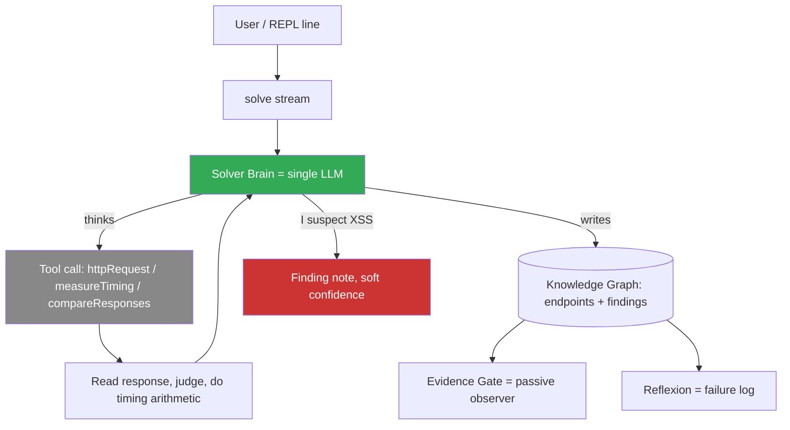

**Why this is not autonomous:** one LLM, one tool call at a time, *while thinking*. The LLM crafts the payload, sends it, reads it, and does the maths. Coverage is bounded by affordable turns; confirmation is an opinion ("I suspect").

---

## B. TARGET autonomous architecture

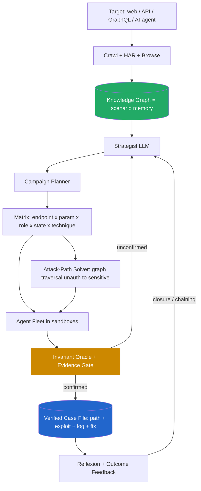

The LLM *strategizes and writes oracles*; deterministic engines *execute and prove*. The graph is the memory; the oracle is the judge; the case file is the product.

---

## C. What makes it AUTONOMOUS (the loop runs with no human per step)

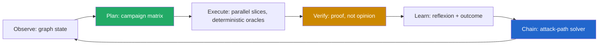

Autonomy = this loop runs to a **budget and scope limit** with **no human in the execution path**. The human sets the goal and approves the report; the machine does the grind (coverage + verification + chaining).

---

## D. Evolution: CURRENT -- to -> TARGET

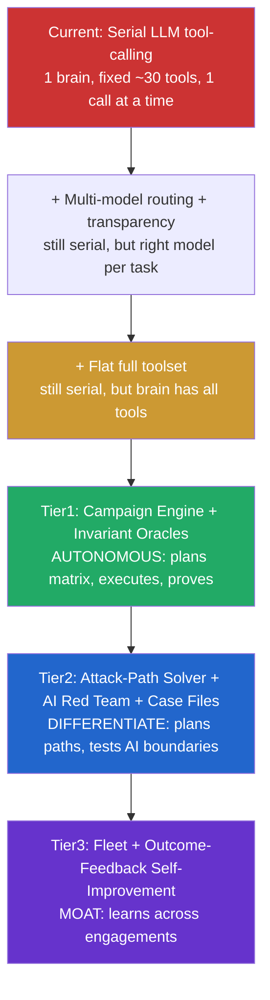

Stages **A-C are the earlier "bandaid" steps** — they keep the serial core. **Real autonomy begins at D.** The R&D value is concentrated in D-F.

---

## E. One autonomous campaign (sequence) — e.g. IDOR + race on /api/order

```mermaid
sequenceDiagram
    participant G as Knowledge Graph
    participant S as Strategist LLM
    participant P as Campaign Planner
    participant F as Agent Fleet
    participant O as Invariant Oracle
    participant CF as Case File

    G->>S: endpoints x params x roles
    S->>P: plan: test /api/order/:id for IDOR + /api/checkout for race
    P->>F: spawn slices (parallel, budgeted, scoped)
    F->>O: attempt invariant break (swap ID; fire N parallel)
    O->>O: deterministic check (state before/after, timing)
    O->>CF: CONFIRMED: cross-tenant read + double-spend
    CF->>G: write verified finding + exploit
    CF-->>S: case file (path + curl PoC + decision log)
    Note over S: no human touched a single request
```

This is the proof of autonomy: a confirmed, reproducible finding produced end-to-end by the machine. The human only later approves the report.

---

## F. Current vs Target — autonomy characteristics

| Characteristic | Current | Target (Tier1+) |
|----------------|---------|----------------|
| Execution | 1 LLM, 1 tool call at a time | Fleet of agents, parallel slices |
| Coverage | Few endpoints the LLM remembers | Every endpoint x param x role x state |
| Confirmation | LLM opinion ("I suspect") | Deterministic invariant oracle |
| Chaining | Manual / post-hoc | Attack-path solver plans + proves chains |
| Memory | Lost across turns | Knowledge graph = persistent scenario |
| Proof artifact | Loose note | Verified case file (exploit + log) |
| Human role | Drives every step | Sets goal, approves report |
| Scale | Bounded by turns | Bounded by budget + scope |

---

## G. One-line takeaway

Current Ultimatrix = **a smart person typing HTTP requests slowly.**<br/>Target Ultimatrix = **a strategist that commands a fleet which proves exploits against the app’s own graph.**

---

## H. Collaborative model — Human + LLM as two agents (the product’s real identity)

This is NOT a one-shot "LLM does everything" system. It is a **collaborative hunting system**: the human and the LLM each do what they are best at, and break the target together.

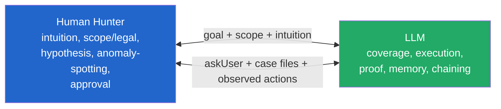

---

## I. Is collaboration actually in the CURRENT architecture? (honest audit)

**Evidence it IS present:**

- **Persona** (`brain-instructions.ts`): "human steers, Hex navigates", "You decide what to investigate. I decide how to investigate it", "I never act without your say-so. We’re a team."
- **`askUser` tool** (`interaction-tools.ts`): the LLM can pause mid-hunt, show a screenshot, and wait for the human.
- **Human action capture** (`capture/human-observer.ts`) + **flow-tools** (`observeHumanActions`, `saveLearnedFlow`, `reproduceFlow`). Crucially, `observeHumanActions` is imported into the **brain’s own toolset** (`brain-tools.ts`) — so the agent can watch and learn from the human live, not just in a separate tool.
- **REPL** (`interact`): turn-based; the human types the goal, the agent hunts.
- **Evidence Gate**: demands "receipts" — aligns with a human who will not trust unproven claims.

**But it is UNDER-REALIZED:**

1. The collaboration is **crude**: the human is mostly *goal-giver + approver*; the LLM is a *serial executor*. There is no tight handshake that invokes the human exactly where they are best — mid-reasoning intuition, spotting a weird behavior, a legal/scope call.
2. The human’s **demonstrated actions are not first-class signals** ingested during the OODA loop; they are used more for test-generation/replay than for live collaborative reasoning.
3. The LLM either runs autonomously (serial) or asks a generic question — there is no structured *division of labor*.

---

## J. Reconciliation with the autonomy plan

The earlier "autonomous" tiers must NOT mean "remove the human." They mean **task-level autonomy**: the machine autonomously runs a *campaign slice the human approved*; the human remains the **intuition + scope + hypothesis layer** — the part machines are worst at.

- Machine removes the human from the **grind** (coverage, verification, chaining).
- Human stays **strategist-of-record + intuition** (the deepest logic flaws need human insight — established earlier).

This is actually a **differentiator vs fully-autonomous Xbow**: for bug bounty, a system that *amplifies the hunter’s intuition* beats a black box, because the highest-value findings still require human judgement. So the product should lean INTO collaboration, not race toward removing the human.

**Reframed Diagram D ladder:** autonomy grows at the *task* level; the human’s role shifts from "drive every step" to "steer + approve + contribute intuition at the hinge points."

---

## K. One-line correction

Not "LLM does everything." It is: **a human’s intuition, scoped and approved, amplified by a machine that provides coverage, execution, proof, and memory none of us could do by hand.**

---

## L. The COLLEAGUE model (refined by user)

The human may be a **beginner** who learns *optionally* by collaborating. The LLM is not a teacher and not a black box - it is a **colleague** that works with the human. The human contributes observations; the colleague cross-verifies and grinds.

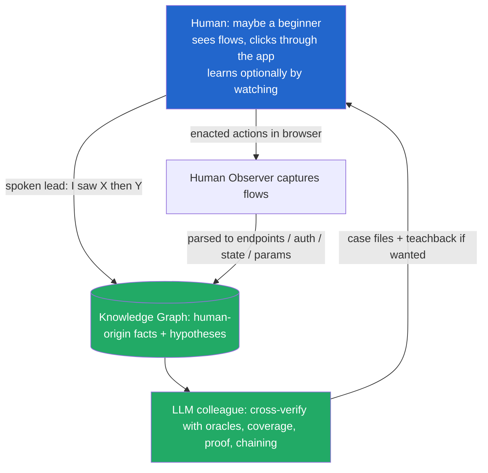

The graph is the **shared memory** both parties write to. The human writes observations; the colleague writes proofs.

---

## M. The wiring gap (verified in code)

The capture + tools exist, but observed human knowledge does NOT flow into the planner as first-class facts. Two broken links (red dashes):

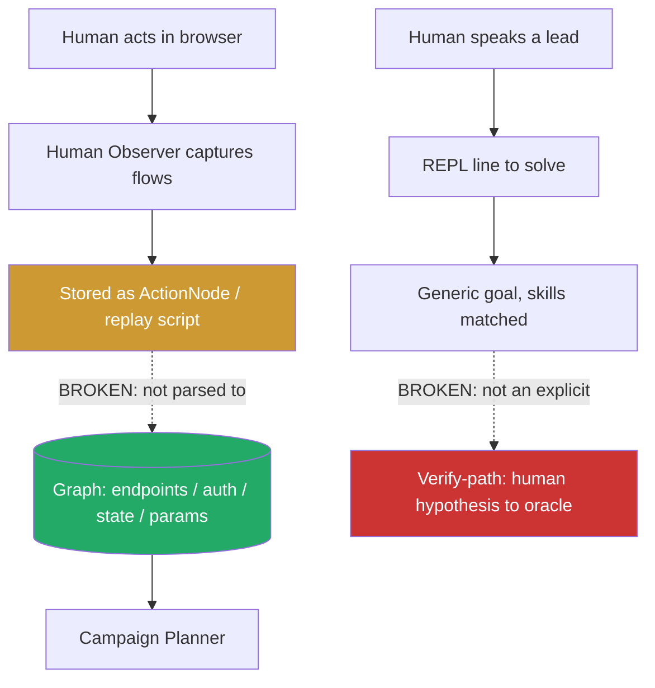

- `human-observer.ts` captures `login | form-fill | navigation | custom` flows - good.
- `flow-tools.ts` `saveSession` + `observeHumanActions` exist and touch the graph - good.
- **Missing:** observed actions are parked as *replay*, not turned into planner-consuming graph facts. And a spoken lead is a *generic goal*, not a *verify-this-hypothesis* task.

---

## N. The fix: Human Observation Ingest + verify-path

1. **Ingest stage:** convert observed `FlowGroup`s into graph nodes the planner uses - `Endpoint` (url+method+params from fills), `AuthFlow` (login detection already exists), `Fact`/`Intent` for state transitions. Mark origin = human.
2. **Spoken-lead parser:** treat a REPL line that describes an observation ("when I do X, Y happens") as a `Hypothesis` node (origin = human) and route it to the **verify-path**: the LLM colleague proves/disproves it with deterministic oracles, then writes a `Finding` or a `disproven` note.
3. **Teachback is optional:** when the colleague proves/disproves a human lead, it may explain *why* - but only if the human wants to learn. The LLM never *must* teach.
4. **Result:** the beginner contributes what only a human can (seeing a weird flow, performing a login) and the colleague contributes what only the machine can (rigorous proof at scale). The graph compounds from BOTH.

---

## O. One-line thesis

Build **a good colleague, not a teacher and not a black box**: the human observes and leads, the LLM cross-verifies and proves, and the knowledge graph is the shared notebook they both write in.

---

## P. Business-Logic Analyser (the missing upstream piece)

Per API action, trace: **what UI action triggered it -> what API fired -> how the webapp reflected it.** That yields the *use case* and *intended behavior* of each endpoint - the ground truth the invariant-oracle needs to hunt logic flaws.

All three input streams already exist; the correlation layer is the gap:

- `human-observer.ts` = UI action (trigger)
- `analysis/har-bridge.ts` (`bridgeHARToGraph`) = API call + params + hypotheses -> graph
- `browser/reaction-observer.ts` = DOM/state change (effect)
- Graph has `EndpointNode / ActionNode / FactNode / IntentNode / AuthFlowNode`

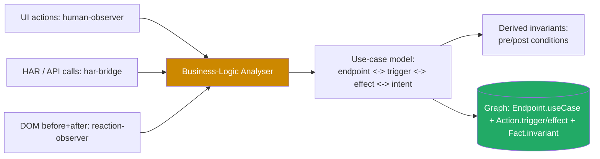

Outputs written to the graph:
- `EndpointNode.useCase` = human-readable purpose (e.g. "transfer funds"), inferred from trigger label + effect.
- `ActionNode` enriched with `trigger` (UI action) and `effect` (state change).
- `FactNode` = derived invariant (e.g. "after transfer, balance decreases by amount").

---

## Q. How the analyser feeds the colleague (and the human corrects it)

The analyser is the **upstream of the lethal engine**: it supplies the invariant ground-truth. It also naturally consumes the human observer from the colleague model - the human clicking "Transfer" gives the trigger, HAR gives the API, reaction gives the effect.

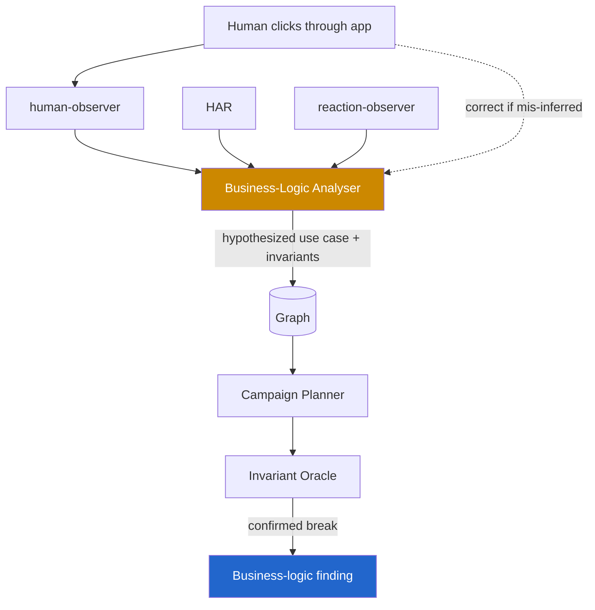

**Honest note:** use-case inference from UI labels is *heuristic*. The analyser emits **hypothesized** use cases/invariants; the colleague *confirms* them with oracles, and the human can correct a mis-inferred use case ("no, that is a refund, not a transfer"). That correction is itself a collaboration signal.

---

## R. Why this is lethal for bounty

Business-logic flaws (price tampering, negative qty, workflow bypass, race on state) require understanding *intended behavior*. The analyser **derives intended behavior from observed usage** - exactly what a human hunter learns by clicking around - and hands it to the colleague as invariants to break. No other tool in the market (Xbow/Neo/Burp) is described as learning use cases from correlated UI+API+DOM observation. This is a genuine differentiator and the natural fusion of the colleague model (Section L) with the autonomous engine (Section B).

## S. One-line thesis

Add a **Business-Logic Analyser** that correlates UI action -> API call -> DOM effect into a use-case + invariant model; it is the shared notebook the human and the LLM colleague both write, and the ground truth the engine proves against.

---

## T. Enriched analyser - the "niche" dimensions

Beyond UI->API->DOM, the analyser should also extract three things that scanners miss:

1. **Custom-header semantics** - classify custom headers (identity / required / static / anti-bot / correlation) and which are needed to call an API at all.
2. **Cross-API value provenance (taint)** - trace each request param/header back to the *response of a prior API call* or a UI input. Reveals real workflow preconditions.
3. **Auth-scheme decode + reuse** - detect Basic/base64/JWT auth, decode reversible schemes, and flag the *same credential material appearing across multiple APIs* (replay / credential-reuse surface).

Seeds already exist: `encode-decode.ts` (base64/jwt decode), `har-bridge.ts` -> `getDataFlows()` + `getSecrets()`.

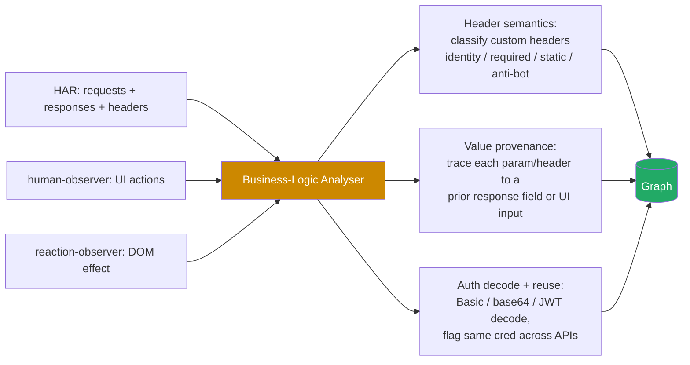

---

## U. Concrete payoff - value provenance + auth reuse

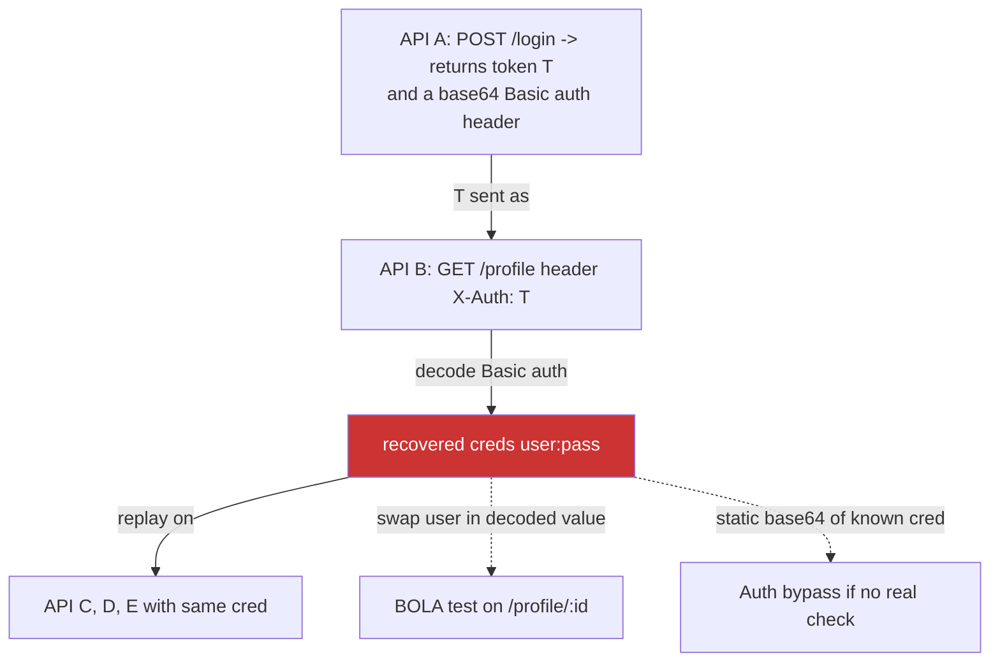

Why each dimension pays:
- **Custom headers**: a required identity header the SPA always sends is often *assumed present* server-side and trivially bypassable if the server forgets to enforce it on a less-traveled endpoint.
- **Value provenance**: "API B needs the ID from API A's response" = a real *precondition/state edge*. The analyser turns it into an invariant ("must call A before B; the value flows A.resp.id -> B.param"), which is exactly the workflow/state-machine the engine probes for bypasses and races.
- **Auth decode + reuse**: a public/base64 `Basic` auth that decodes to `user:pass` and is reused across APIs is a direct **credential-reuse / BOLA / auth-bypass** surface - replay the decoded cred on sibling APIs, or swap the user in the decoded value to test object access.

---

## V. Notes / honesty

- Decoding base64 Basic auth is *trivial*; the **insight** (same cred reused across APIs -> replay surface) is the value the analyser adds. Do not just decode - correlate across endpoints.
- Handle recovered credentials carefully: mask in logs, keep them scoped to the engagement, never exfiltrate. The analyser should flag *reuse*, not store plaintext creds broadly.
- `getDataFlows()` already tracks token propagation - extend it to full param/header provenance, not just tokens.
- The human observer (a real login the user performs) gives the analyser the *live* auth flow to decode - again fusing the colleague model with the analyser.

## W. One-line thesis

The analyser must go beyond UI/API/DOM: it should **classify custom headers, trace cross-API value provenance, and decode/reuse auth material** - these niche correlations are what turn "I see an API" into "I understand the app's trust and data-flow model," which is where modern bounties live.
